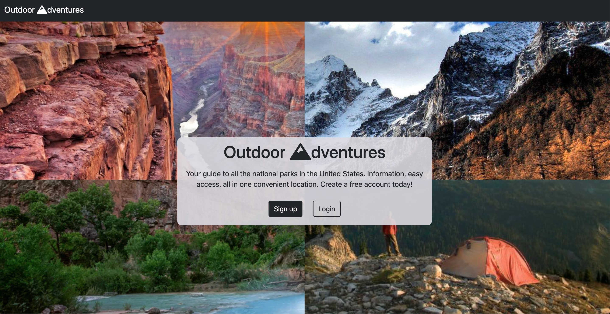
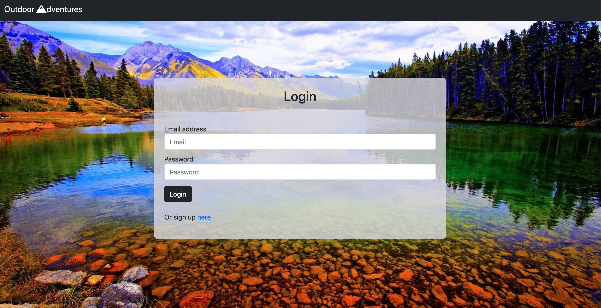
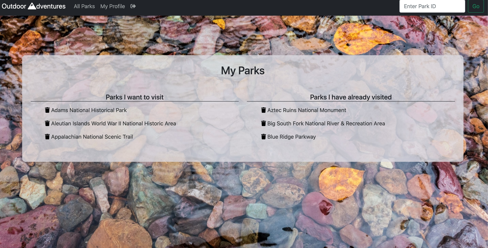
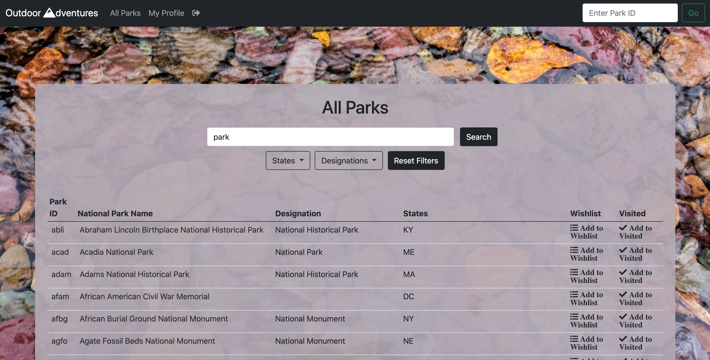

# Outdoor-Adventures



## Description 
This application is designed to allow the user to easily look up and access information about all of the national parks in the United states.  Users sign up to an account and are able to navigate through a table that stores all the data for the national parks.  This table includes search filters that allow users to search for a park by it’s name, state, designation or any combination of those search filters.  The user is able to add the parks to there profile to keep track of ones they have either visited or are interested in going to.  The user is also able to click on a specific park in the table to find out more information about the park and a link to the park’s website.  All data is provided by the national parks api.

## Collaborators
[Tommy Craft](https://github.com/DJFriar) <br/>
[Harrison Glover](https://github.com/Glove1911) <br/>
[Mark Mulligan](https://github.com/Mark-Mulligan)

## Table of Contents
* [Technical-Features](#Technical-Features)
* [Installation](#installation)
* [Usage](#usage)

## Technical-Features
* Uses passport to authenticate users
* Populates database using parks api request when the server is started.  This allows for the data to be updated easily and makes sure it is up to date.
* Use Sequilize to interact with database.
* Advanced Search Queries and Filtering
* Axios for api requests

#### Built With
* Node.js 
* Express.js 
* MySQL 
* Passport
* Sequilize
* Bootstrap 
* Express-Handlebars

## Installation
### View the Project Live
If you would like to view this project live, you can use the link Below. <br/>
https://smu-project-outdoor-adventures.herokuapp.com/

### Run the Project Locally
** This project requires node.js and mySQL to run locally so make sure those are installed on your device.  **

* Step 1: Navigate to the directory you want to store the project. Clone this your repository to your local computer using the command below. 
```bash
git clone https://github.com/DJFriar/SMU-Project-02-Outdoor-Adventures.git
```

* Step 2: Navigate to the directory that you cloned the project.
Example:
```bash
cd directory/projectdirectory
```

* Step 3: Install the npm package dependencies from the package.json file.
```bash
npm install
```

* Step 4: Make sure mySQL is set up on your computer and a local instance is running for your program to interact with. 
[mySQL documentation](https://dev.mysql.com/doc/) 

* Step 5: Create the database that sequilize will use.  The name of the database should be outdoorAdventures.

* Step 6: Make sure to update the config.js file in the config folder with your correct local data to connect to your instance of mySQL.

* Step 7: Visit the national parks api and sign up to get you api key.  This will be used to make a request to their api to populate the database for this project when the server is started. Then update the api key in the places it is used (listed below).
[National Parks Service API](https://www.nps.gov/subjects/digital/nps-data-api.htm) <br/>

+ API KEY USED <br/>
+ line 124 in /routes/html-routes.js <br/>
+ Line 6 in /seed.js

* Step 8: While in the project directory, run the program using node using the command below. Open you browser and navigate to localhost:8080 to view the application.
```bash
node app.js
```  

## Usage 
#### Make An Account
1.  On the home page, click the 'Sign up' button.
2.  Create a user name and password and submit the form.  That's it, your account is created. 
3.  If you have already created an account, you can use the login in page to sign in.  



#### Profile Page
This page allows you to view parks that you have selected as either wanting to visit or have already visited.  



#### Parks Page
This page allows you to search through all the national parks.  You can use the search input to search via park name.  You also add filters to search based on state or park designation.  

* Click on Add to Wish list to add the park to that section of your profile page. 
* Click on Add to Visted to add the park to that section of your profile page. 
* Click on the park name in the table to see a page with additional information about that park and a link to the parks website.   



